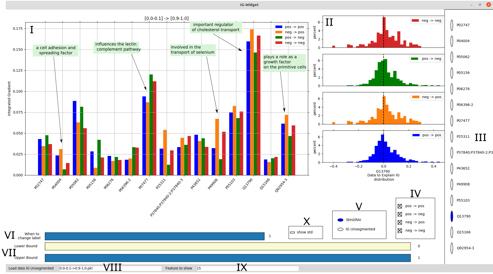

# stingrai-widget
A widget to calculate integrated gradients of neural networks for numerical tabular datasets.

# Overview
1. Train model, which should be analyzed
2. Split the data set on the basis of the prediction of the model 
   into intervals with **__code_of_project/get_index_in_interval__**. 
3. Calculate explanations for differences between intervals with **code_of_project/calculate_ig**.
4. Visualize the Integrated gradients with **code_of_project/widget**.
5. Compare explanations given by StInGRAI and IG_Unsegmented. 

# Example Output 

Visualisation of the explanation given by the Integrated Gradient for DioGenes data set

# Instruction 
1. Train your model. You can add the code for this in **code_of_project/train_models**:
   The original data can be stored in **datasets**. 
   Store the data as it is fed into the neural network, the predictions and the labels in **models/experiment_name**.

2. Split the data set on the basis of the prediction of the model. 
   
    a) Choose your settings in **code_of_project/get_index_in_interval/get_index_in_interval_args.py**
   
   b) Start splitting with **get_index_for_StInGRAI.py**
   
c) With the script **construct_ig_unsegmented_paths.py** arbitrary intervals can be combined.
   

3. Calculate explanations for differences between intervals with **code_of_project/calculate_ig**.
   
    a) Add the steps your model need to do predictions in 
     **code_of_project/prediction_object/PredictionObject.py**.

    b) Choose your settings in **code_of_project/calculate_ig/calculate_ig_args.py**.
   
   c) Use `cd` to go to the folder containing the intervals you calculated in step 2.  
   
    d) Type `ls -a` in the terminal to get all files in the folder. 
   
    e) Adjust the settings in **code_of_project/calculate_ig/calculate_ig_args.sh**. 
   
    f) Add the files for which the IG should be calculated in the bash scripts in the folder 
       **code_of_project/calculate_ig/bash_scripts
   
   g) Start the script `calculate_ig_unsegmented.sh or calculate_StInGRAI.sh in the terminal  

4. Visualize the Integrated gradients with **code_of_project/widget**.

   a) Choose your settings **code_of_project/widget/widget_args.py**

   b) Start the visualization with  **code_of_project/widget/start_widget.py**

5. Comparison of the explanations given by StInGRAI and IG_Unsegmented
   
   a) Choose your settings **code_of_project/compare_IG_Unsegmented_vs_StInGRAI/get_explanations/get_explanation_args.py**
   
   b) Save explanations by running  **code_of_project/compare_IG_Unsegmented_vs_StInGRAI/get_explanations/get_explanation.py**
   
   c) Choose your settings **code_of_project/compare_IG_Unsegmented_vs_StInGRAI/compare/compare_args.py**
   
    d) Compare explanations regarding spearman_correlation and absolute error with **code_of_project/compare_IG_Unsegmented_vs_StInGRAI/compare/compare_IG_Unsegmented_vs_StInGRAI.py**

# Problems
1. Problem: Can't interact with plots. 
   
   Solution: Using IDE maybe matplotlib interactive mode is blocked.
   For Pycharm please uncheck Settings | Tools | Python Scientific | Show Plots in Tool window 
   Test matplotlib interactive mode with code_of_project/test/buttons.py
   
2. Problem:UserWarning: Matplotlib is currently using agg, which is a non-GUI backend, so cannot show the figure.
  plt.show()
   
   Solution: All I had to do was to install tkinter through the Linux bash terminal using the following command:
   sudo apt-get install python3-tk
   
# Contact 
In case of problems or suggestions please contact jannis.brugger[at]tu-darmstadt[dot]de 
